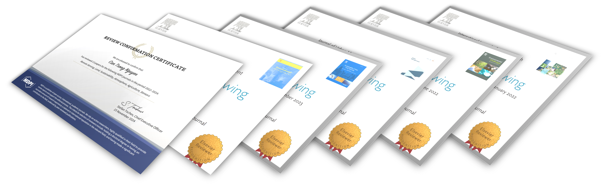



>Over the past few years, starting from my doctoral program (2021), I have gained several opportunities to contribute to the peer-review process of over 31 Journals from >05 Publishers. 
>
>My goal is to ensure scientific rigor while still encouraging and helping young scientists improve their research. 

 

### **Editorial Board Member**

<a href="https://link.springer.com/journal/44327/editorial-board">Discover Cities</a>, Springer (<i>from 09/2024</i>) 
<a href="https://link.springer.com/journal/43621/editorial-board">Discover Sustainability</a>, Springer
 

### **Project Evaluation**

<a href="https://www.ncn.gov.pl/en/finansowanie-nauki/konkursy/typy/2">PRELUDIUM</a>, National Science Center, Poland 
 

### **Membership**

International Association for Urban Climate<a href="https://urban-climate.org/"> (IAUC)</a> 
European Geosciences Union<a href="https://www.egu.eu//"> (EGU)</a> 
Global Land Programme <a href="https://glp.earth/users/trong-can-nguyen"> (GLP) </a> 
Young Ecosystem Service Specialists <a href="https://www.es-partnership.org/services/networking/young-es-specialists-yess/"> (YESS)</a>
 

### **Peer Reviewer for**

#### Elsevier  (11 Journals)

(1) <a href="https://www.sciencedirect.com/journal/sustainable-cities-and-society">Sustainable Cities and Society</a>; 
(2) <a href="https://www.journals.elsevier.com/international-journal-of-applied-earth-observation-and-geoinformation">Journal of Applied Earth Observation and Geoinformation</a>; 
(3) <a href="https://www.sciencedirect.com/journal/the-egyptian-journal-of-remote-sensing-and-space-science">The Egyptian Journal of Remote Sensing and Space Sciences</a>; 
(4) <a href="https://www.journals.elsevier.com/environmental-challenges">Environmental Challenges</a>; 
(5) <a href="https://www.cell.com/heliyon/home">Heliyon</a>; 
(6) <a href="https://www.sciencedirect.com/journal/world-development-sustainability">World Development Sustainability</a>; 
(7) <a href="https://www.sciencedirect.com/journal/journal-of-urban-management">Journal of Urban Management</a>; 
(8) <a href="https://www.sciencedirect.com/journal/advances-in-space-research">Advances in Space Research</a>; 
(9) <a href="https://www.sciencedirect.com/journal/urban-climate">Urban Climate</a>; 
(10) <a href="https://www.sciencedirect.com/journal/urban-forestry-and-urban-greening">Urban Forestry & Urban Greening</a>; 
(11) <a href="https://www.sciencedirect.com/journal/environmental-and-sustainability-indicators">Environmental and Sustainability Indicators</a>
 

#### Springer & Springer Nature (7 Journals)

(1) <a href="https://www.springer.com/journal/11356">Environmental Science and Pollution Research</a>; 
(2) <a href="https://link.springer.com/journal/704">Theoretical and Applied Climatology</a>; 
(3) <a href="https://www.nature.com/srep/">Scientific Reports</a>; 
(4) <a href="https://link.springer.com/journal/41748">Earth Systems and Environment</a>; 
(5) <a href="https://link.springer.com/journal/10661">Environmental Monitoring and Assessment</a>; 
(6) <a href="https://link.springer.com/journal/11119">Precision Agriculture</a> 
(7) <a href="https://link.springer.com/journal/44327">Discover Cities</a>  
 

#### Taylor and Francis  (4 Journals)

(1) <a href="https://www.tandfonline.com/journals/tjde20">International Journal of Digital Earth</a>; 
(2) <a href="https://www.tandfonline.com/toc/tgsi20/current">Geo-spatial Information Science</a>;
(3) <a href="https://www.tandfonline.com/journals/oaes21">Sustainable Environment</a>;
(4) <a href="https://www.tandfonline.com/journals/nurw20">Urban Water Journal</a>;
 

#### MDPI  (6 Journals)

(1) <a href="https://www.mdpi.com/journal/remotesensing">Remote Sensing</a>; 
(2) <a href="https://www.mdpi.com/journal/sustainability">Sustainability</a>; 
(3) <a href="https://www.mdpi.com/journal/atmosphere">Atmosphere</a>; 
(4) <a href="https://www.mdpi.com/journal/agriculture">Agriculture</a>; 
(5) <a href="https://www.mdpi.com/journal/sensors">Sensors</a>;
(6) <a href="https://www.mdpi.com/journal/land">Land</a>
 

#### IOP  (4 Journals)

(1) <a href="https://iopscience.iop.org/journal/1748-9326">Environmental Research Letters</a>; 
(2) <a href="https://iopscience.iop.org/journal/2515-7620">Environmental Research Communications</a>; 
(3) <a href="https://iopscience.iop.org/journal/2752-664X">Environmental Research: Ecology</a>;  
(4) <a href="https://iopscience.iop.org/journal/2752-5309">Environmental Research: Health</a> 
 

#### Other Journals & Conferences

(1) <a href="http://www.serena.unina.it/index.php/tema/">TEMA Journal of Land Use, Mobility and Environment</a> (ESCI); 
(2) <a href="https://www.eurogeojournal.eu/index.php/egj/index">European Journal of Geography</a> (Scopus)
(3) <a href="https://ctujs.ctu.edu.vn/index.php/ctujs/index">CTU Journal of Innovation and Sustainable Development</a> (ACI, DOAJ); 
(4) The 42nd Asian Conference on Remote Sensing <a href="https://a-a-r-s.org/">(AARS)</a>; 
(5) National GIS Conference in Vietnam (<a href="https://gis2024.ctu.edu.vn/">GIS2024</a>)

 
 
